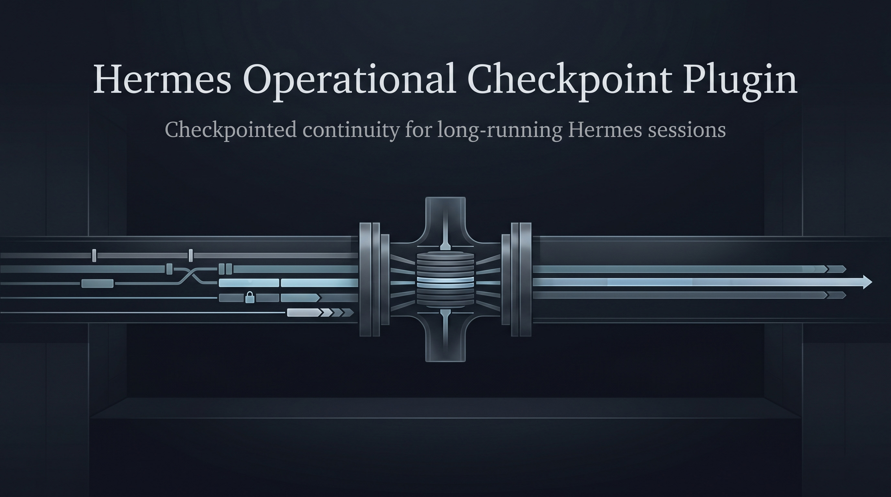

# Hermes Operational Checkpoint Plugin



Operational Checkpoint is a compression plugin for Hermes for sessions that go on long enough that a normal summary starts to feel a little too soft around the edges.

Hermes already has auto-compression. This plugin is not trying to replace that idea with something completely different. It is trying to make the continuation after compression feel more solid when the session has a lot of real state in it: decisions that were already made, constraints that were discovered along the way, failed paths that should not be retried, and a clear sense of what the next move should be.

That is really the whole point of this project. On long technical sessions, it is often not enough for the model to remember the general topic. What matters is whether it can continue the work without blurring what was actually learned.

Operational Checkpoint leans into that. Instead of treating compression as a broad recap, it writes a denser checkpoint meant to carry the work forward. The emphasis is on continuity: what is true, what changed, what matters now, and what should happen next.

It is especially useful for long debugging runs, deep codebase work, multi-step implementation, research sessions, and agent runs that may compact more than once. In those cases, the difference between “the model kind of remembers” and “the session still has a strong working state” becomes very noticeable.

Compared with Hermes' native compression, this plugin currently gives you a few specific things:

- a denser continuation checkpoint instead of a broader handoff-style summary
- same-session compression instead of moving the work onto a child continuation session
- plugin-owned checkpoint runtime selection, so compression is not quietly steered by upstream auxiliary compression defaults
- full-window checkpointing by default, rather than preserving raw head and tail anchors unless you opt into that
- plugin-owned auto-compression and manual compression status lines that talk about context-budget reduction instead of message-count reduction
- checkpointed continuity layered over retained raw history, so the live session stays tighter without pretending the old history disappeared

Once you enable `context.engine: operational_checkpoint`, this plugin becomes the active compression engine for the session. It changes when auto-compression triggers, how manual compression behaves, what gets compressed, how the checkpointed state is written, how that state is resumed later, and how compression shows up in the CLI.

The behavior is intentionally simple. It uses explicit token thresholds, keeps compression on the active session, and gives you checkpointed continuity over retained history. The live working view is compressed, but the raw session history is still kept separately. By default it checkpoints the full compression window instead of preserving a raw head or tail.

The shipped defaults look like this:

```toml
[defaults]
model = "gpt-5.4-mini"
reasoning_effort = "medium"
summary_retry_attempts = 3
context_limit_tokens = 400000
auto_compact_at_tokens = 350000
head_preserve_messages = 0
minimum_tail_messages = 0
tail_preserve_tokens = 0
```

If you want head or tail protection, those settings still exist. They are just not the default anymore.

## Install

The easiest install is a single shell line from GitHub:

```bash
uv pip install \
  --python ~/.hermes/hermes-agent/venv/bin/python \
  "git+https://github.com/ReyJ94/Hermes-Operational-Checkpoint-Plugin.git" && \
  hermes config set context.engine operational_checkpoint
```

That installs the plugin into the Hermes virtualenv and enables it as the active context engine in one shot.

If you do not use `uv`, the plain `pip` version is:

```bash
~/.hermes/hermes-agent/venv/bin/pip install \
  "git+https://github.com/ReyJ94/Hermes-Operational-Checkpoint-Plugin.git" && \
  hermes config set context.engine operational_checkpoint
```

If you are installing from a local checkout instead, use the source install path:

```bash
cd /path/to/operational-checkpoint
uv build --wheel --out-dir dist
uv pip install \
  --python ~/.hermes/hermes-agent/venv/bin/python \
  --force-reinstall \
  dist/operational_checkpoint-*.whl && \
  hermes config set context.engine operational_checkpoint
```

If you prefer plain `pip` for a local checkout:

```bash
cd /path/to/operational-checkpoint
python -m pip install build
python -m build --wheel --out-dir dist
~/.hermes/hermes-agent/venv/bin/pip install \
  --force-reinstall \
  dist/operational_checkpoint-*.whl && \
  hermes config set context.engine operational_checkpoint
```

After that, start Hermes normally with `hermes`.

If you later update a local source checkout, rebuild and reinstall before testing again. Hermes will not pick up local source edits from this repo unless the installed wheel is refreshed.

## Configuration

Plugin defaults live in `operational_checkpoint.toml`. Hermes config can still override threshold and CLI behavior if you want to tune them:

```yaml
operational_checkpoint:
  context_limit_tokens: 400000
  auto_compact_at_tokens: 350000
  head_preserve_messages: 0
  minimum_tail_messages: 0
  tail_preserve_tokens: 0
  summary_retry_attempts: 3
  cli:
    emit_compaction_status: true
    show_summary_preview: false
    summary_preview_chars: 160
```

One important detail: the plugin now owns its own checkpoint-generation runtime. In practice that means plugin compression no longer depends on upstream `auxiliary.compression.*` defaults leaking into the summary call.

## What It Looks Like

When auto-compression happens, the plugin can emit status lines like this:

```text
🗜️  Operational Checkpoint: auto-compacting ~123,456 / 350,000 tokens...
  ✅ Operational Checkpoint reduced active context budget: ~123,456 → ~18,200 tokens
```

That wording is deliberate. For this plugin, the meaningful thing is the reduction in active context budget, not a message-count story that can be misleading once the session is being checkpointed and hydrated.

## Quick Check

Inside Hermes, run `/plugins` and make sure `operational_checkpoint` is enabled.

Then try something simple:

```text
/clear
say a few things
/compress
```

If the plugin is active, manual compression should work normally, and auto-compression should use the plugin-owned status lines as well.

## Development

If you are developing the plugin itself, tests run against the Hermes virtualenv:

```bash
/home/reyj94/.hermes/hermes-agent/venv/bin/python -m pytest -q
```

If you want to test the real installed path again:

```bash
cd /path/to/operational-checkpoint
uv build --wheel --out-dir dist
uv pip install \
  --python ~/.hermes/hermes-agent/venv/bin/python \
  --force-reinstall \
  dist/operational_checkpoint-*.whl
```

## License

MIT
